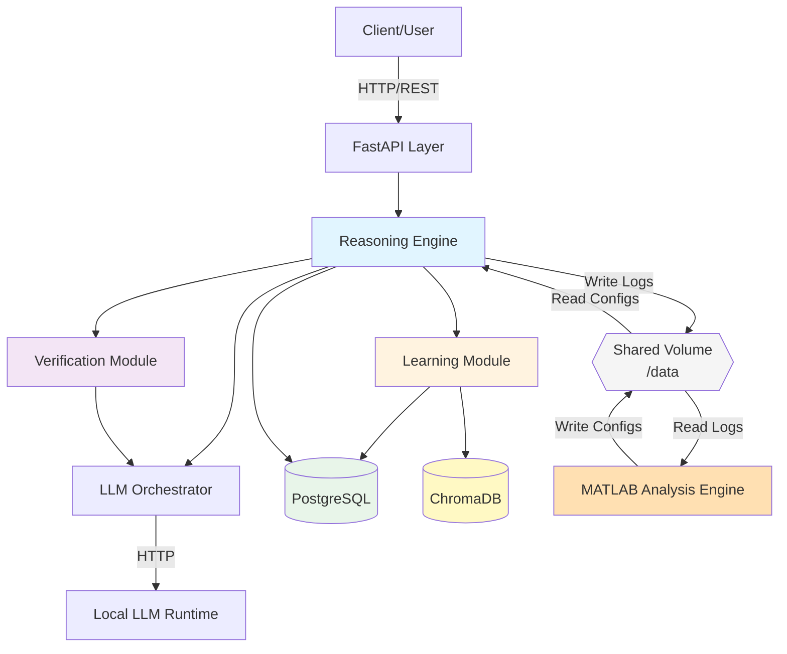
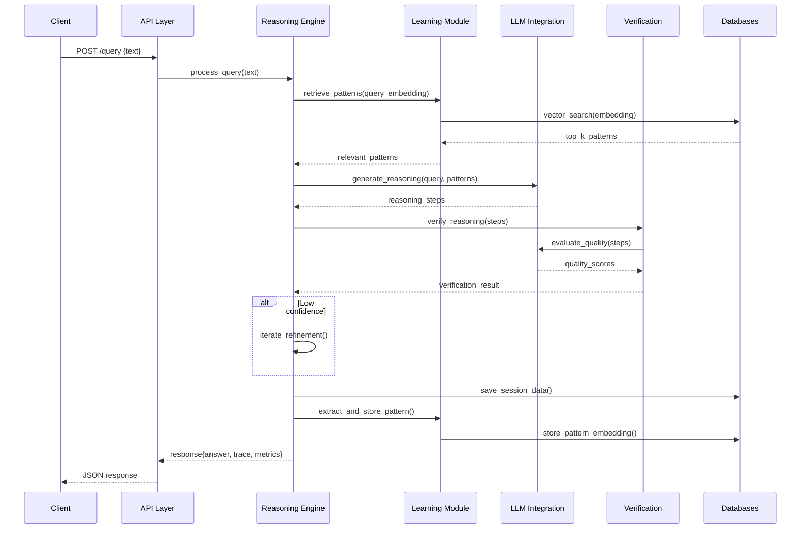
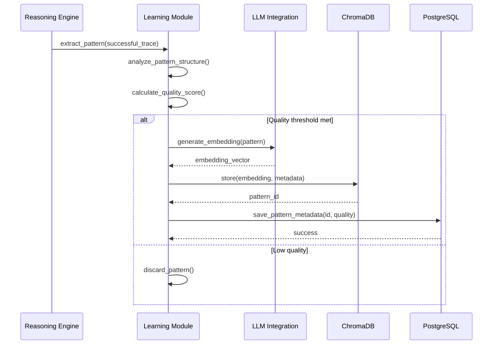
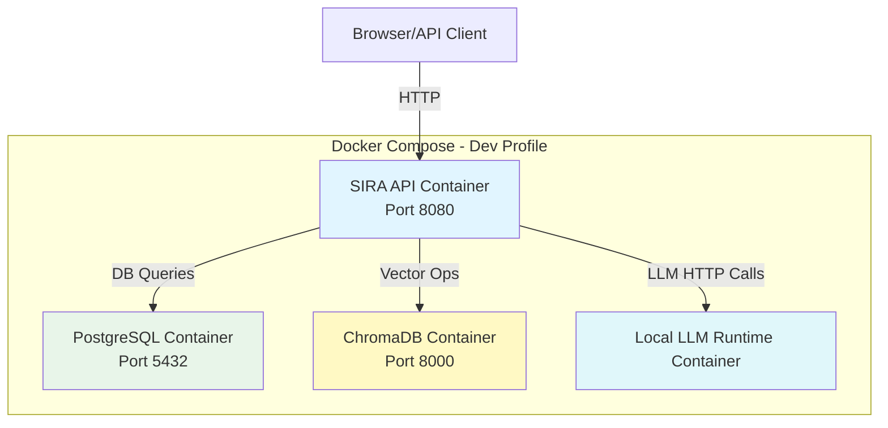

# Solution Architecture - SIRA

## Architecture Overview

SIRA follows a layered architecture with clear separation of concerns:



## System Components

### 1. API Layer (FastAPI)
**Responsibility:** External interface for SIRA system

**Components:**
- REST endpoints (`/query`, `/session`, `/patterns`, `/metrics`)
- Request validation and parsing
- Response formatting
- Error handling
- CORS configuration (for web UI)

**Technology:** FastAPI, Pydantic models

---

### 2. Reasoning Engine
**Responsibility:** Orchestrate multi-step reasoning process

**Components:**
- Query analyzer
- Reasoning coordinator
- Step generator
- Iteration manager
- Trace aggregator

**Key Operations:**
1. Parse incoming query
2. Retrieve relevant patterns from Learning Module
3. Generate reasoning steps via LLM Integration
4. Verify steps via Verification Module
5. Iterate if needed
6. Return final answer with trace

**Technology:** Python core logic, async/await for LLM calls

---

### 3. Verification Module
**Responsibility:** Self-assessment of reasoning quality

**Components:**
- Quality scorer
- Confidence calculator
- Error detector
- Consistency checker

**Key Operations:**
1. Evaluate reasoning step quality
2. Calculate confidence scores
3. Flag low-confidence results
4. Trigger refinement when needed

**Technology:** Python logic + LLM calls for verification prompts

---

### 4. Learning Module
**Responsibility:** Pattern extraction, storage, and retrieval

**Components:**
- Pattern extractor
- Embedding generator
- Pattern store interface
- Pattern ranker
- Quality updater

**Key Operations:**
1. Extract patterns from successful reasoning
2. Generate embeddings for patterns
3. Store patterns in ChromaDB
4. Retrieve similar patterns for queries
5. Update pattern quality based on usage

**Technology:** Python, sentence-transformers for embeddings, ChromaDB client

---

### 5. LLM Integration Layer
**Responsibility:** Provide a provider-agnostic interface to a local/self-hosted LLM runtime.

**Components:**
- LLM orchestrator abstraction (interface/protocol)
- Local LLM runtime client (HTTP, OpenAI-style API)
- Optional backend configuration for multiple local models
- Retry logic and basic rate limiting
- Metrics hooks for call counts and latency

**Key Operations:**
1. Send prompts to the configured local LLM runtime
2. Handle HTTP errors and retries
3. Track usage and latency
4. Return structured responses to the reasoning engine

**Technology:** Python protocols, httpx for async HTTP calls to the local runtime

---

### 6. Data Layer

#### PostgreSQL (Structured Data)
**Stores:**
- Session metadata (ID, timestamps, user context)
- Query/response pairs
- Metrics (accuracy, reuse rate, corrections, timing)
- Configuration state

**Schema (simplified):**
```sql
sessions (id, created_at, user_context)
queries (id, session_id, query_text, answer_text, reasoning_trace, timestamp)
metrics (id, query_id, accuracy, confidence, pattern_reuse, reasoning_depth, timestamp)
patterns_meta (id, quality_score, usage_count, created_at, updated_at)
```

#### ChromaDB (Vector Data)
**Stores:**
- Reasoning pattern embeddings
- Pattern metadata (context, quality, original query)
- Pattern usage statistics

**Collections:**
- `reasoning_patterns`: Main pattern storage

---

### 7. Web Interface
**Responsibility:** User-facing monitoring and visualization

**Components:**
- Query submission form
- Reasoning trace visualizer
- Pattern browser/search
- Metrics dashboard
- Session history viewer

**Technology:** HTML/CSS/JavaScript (vanilla or lightweight framework), served via FastAPI static files

---

### 8. MATLAB Analysis Engine
**Responsibility:** Offline quantitative analysis and optimization

**Components:**
- Episode analyzer
- Statistical modeler
- Hyperparameter optimizer
- Signal processor (trace analysis)
- Learning curve fitter
- Strategy selector
- Visualization generator
- Config writer

**Key Operations:**
1. Read episode logs and traces from shared volume
2. Compute success rates, convergence, sensitivity analysis
3. Build regression models predicting performance
4. Analyze reasoning traces as time-series signals
5. Optimize hyperparameters using optimization toolbox
6. Generate tuned configs and strategy policies
7. Produce visual reports and dashboards

**Technology:** MATLAB R2023b+, Optimization Toolbox, Statistics and Machine Learning Toolbox, Signal Processing Toolbox

**Integration:** File-based via shared `/data` volume (no direct API calls)

---

## Data Flow Diagrams

### Query Processing Flow



### Pattern Learning Flow



## Deployment Architecture



## Technology Stack Summary

| Layer | Technology | Purpose |
|-------|-----------|---------|
| API | FastAPI | REST endpoints, request handling |
| Core Logic | Python 3.12 | Reasoning, learning, verification |
| Relational DB | PostgreSQL | Sessions, metrics, metadata |
| Vector DB | ChromaDB | Pattern embeddings, similarity search |
| LLM | Local LLM Runtime (OpenAI-style API) | Reasoning and verification |
| Embeddings | sentence-transformers | Pattern vectorization |
| Container | Docker + Docker Compose | Deployment, isolation |
| Testing | pytest | Unit and integration tests |

## Design Principles

1. **Separation of Concerns:** Clear boundaries between reasoning, learning, verification
2. **Abstraction:** LLM orchestrator abstraction enables flexibility across runtimes/models
3. **Async-First:** Non-blocking I/O for LLM and database calls
4. **Fail-Safe:** Graceful degradation when local LLM runtime calls fail
5. **Observable:** Comprehensive logging and metrics
6. **Testable:** Dependency injection, clear interfaces
7. **No Mock Data:** All testing uses real data; errors visible

## Scalability Considerations

### Current Scope (Phase 1)
- Single-instance deployment
- Vertical scaling (more resources per container)
- Suitable for research and development use

### Future Enhancements (Out of Scope)
- Horizontal scaling with load balancing
- Distributed pattern storage (ChromaDB clustering)
- Read replicas for PostgreSQL
- Caching layer (Redis) for frequent patterns
- Message queue for async pattern learning

## Security Architecture

- **API Keys:** Environment variables only (.env file)
- **Input Validation:** Size limits, sanitization at API layer
- **SQL Injection:** Parameterized queries via SQLAlchemy ORM
- **Secrets Management:** Never logged, never stored in patterns
- **Network:** Containers isolated in Docker network

## Monitoring & Observability

- **Logging:** Structured JSON logs to stdout/stderr
- **Metrics:** PostgreSQL metrics table + exposed via API
- **Tracing:** Request ID propagation through layers
- **Health Checks:** `/health` endpoint for container orchestration

---

See also:
- `solution-design.md` - Detailed component design
- `tech-stack-and-language.md` - Technology justifications
- `deployment-topology.md` - Docker compose configuration details
